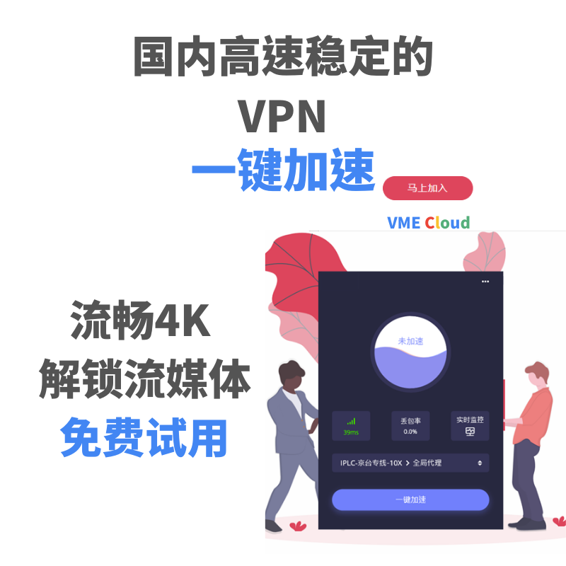
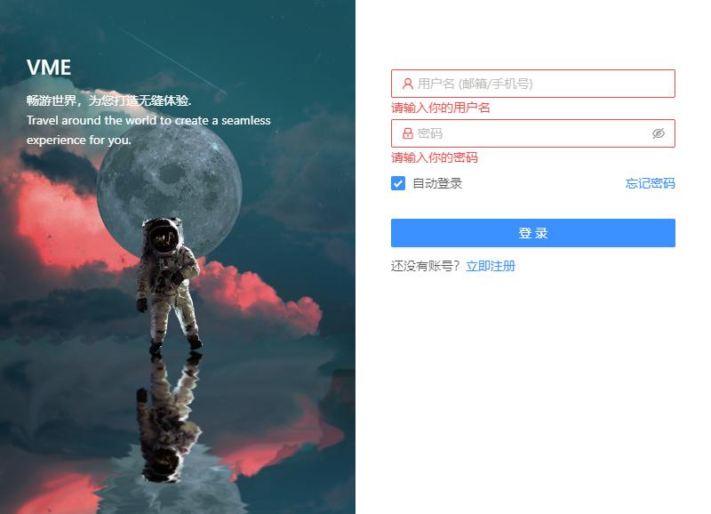

# VME客户端（推荐使用）

### 1.下载 VME 一键加速客户端

_\*\*\*\*_[_**点此下载**_](https://vme.icu/client-download/VME-win.exe)_\*\*\*\*_

_**注意: 安装前一定要关闭360或者电脑管家等流氓软件，否则会被禁止代理设置。同时不要打开多个代理软件\(VPN软件\),会端口冲突!**_

### 2.打开VME客户端,输入账户密码登录软件。

###  3. 选择节点

若显示&lt;暂无线路&gt;,请在商店订阅&lt;免费试用&gt; 或者购买套餐.

**&lt;商店&gt;** [传送门 ](https://vmec.online/user/shop)

###  4. VME 客户端常见问题解答

* **VME 客户端下载后无法打开控制面板？** 恭喜您！！您的PC不支持OpenGL, 请右上角&lt;其他客户端&gt; 选择下载 Clash 客户端（或者V2rayN客户端）。
* **选择节点并加速后无法翻墙？** Ⅰ.请检查您右下角系统时间，必须与标准北京时间一致（误差不能超过2分钟）。建议访问[https://time.is ](https://time.is/)参照并进行手动修改。 Ⅱ.请检查您的浏览器是否启用了其他VPN代理插件, 请停用后再尝试.Chrome浏览器请在右上角菜单-&lt;设置&gt;-&lt;高级&gt;-&lt;系统&gt;检查代理设置. Ⅲ.如果所有节点均不能正常连接,延迟都显示5超时请修改您的DNS设置,默认推荐修改为Google的DNS服务器即可.
* **如果您是拨号上网，连接节点后无法翻墙？** 请打开您的&lt;网络共享中心&gt; - &lt;更改适配器设置&gt; , 重命名您的拨号上网名称为英文,重启电脑即可。
* **刚才还能用啊，怎么突然全部节点都不能用了？** 请检查您的套餐流量是否耗尽，谢谢！
* **若出现部分国外网站能正常浏览,部分网站加载很慢甚至不能访问/** 请切换&lt;全局模式&gt;,可能是自动模式的判断出现延迟或者错误导致。
* **浏览和看视频的速度很快，但下载速度很慢？** 如果下载源是国内，请关闭VPN软件。如果下载源在国外，由于VME客户端不支持UDP流量，所以您必须使用V2rayN或者Clash进行tcp流量下载。另外本站全部节点禁止BT下载，多次触发审计规则的账号会进行封禁。

