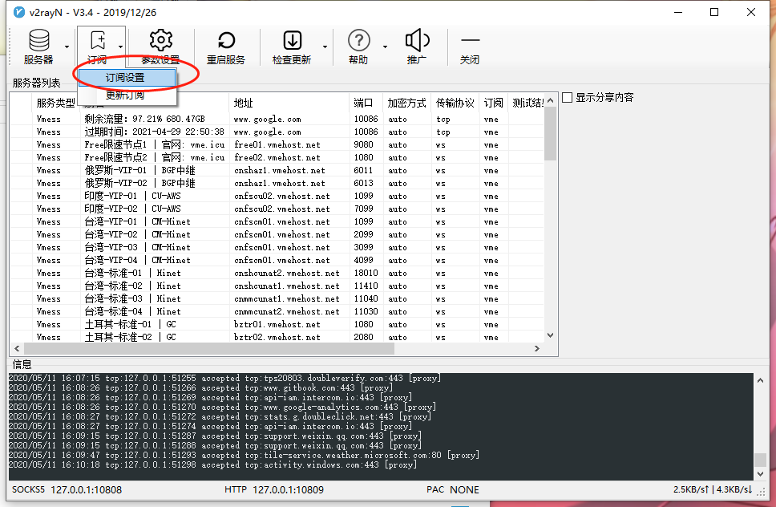
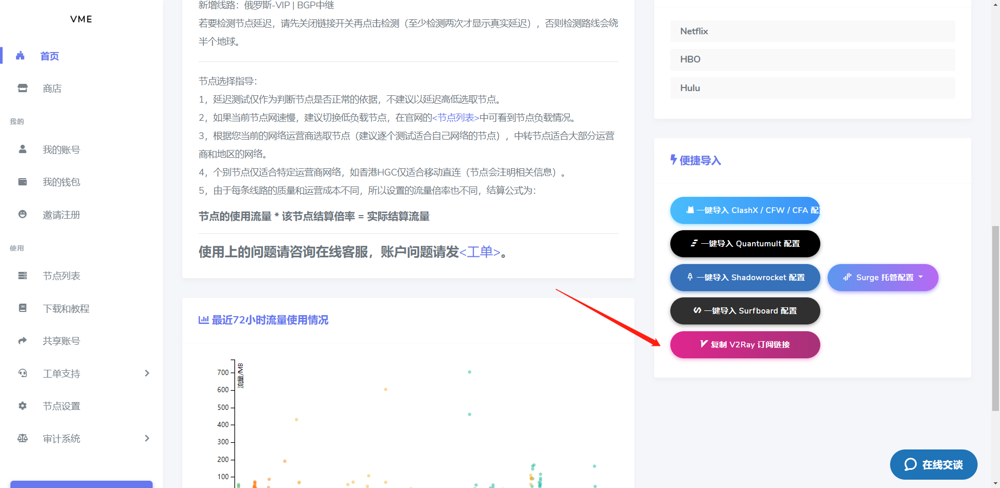
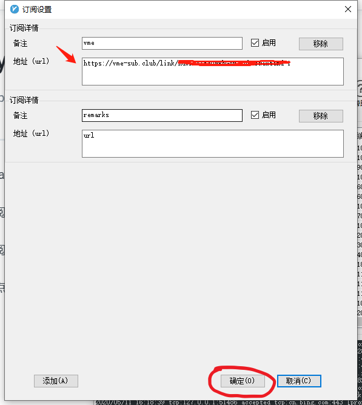
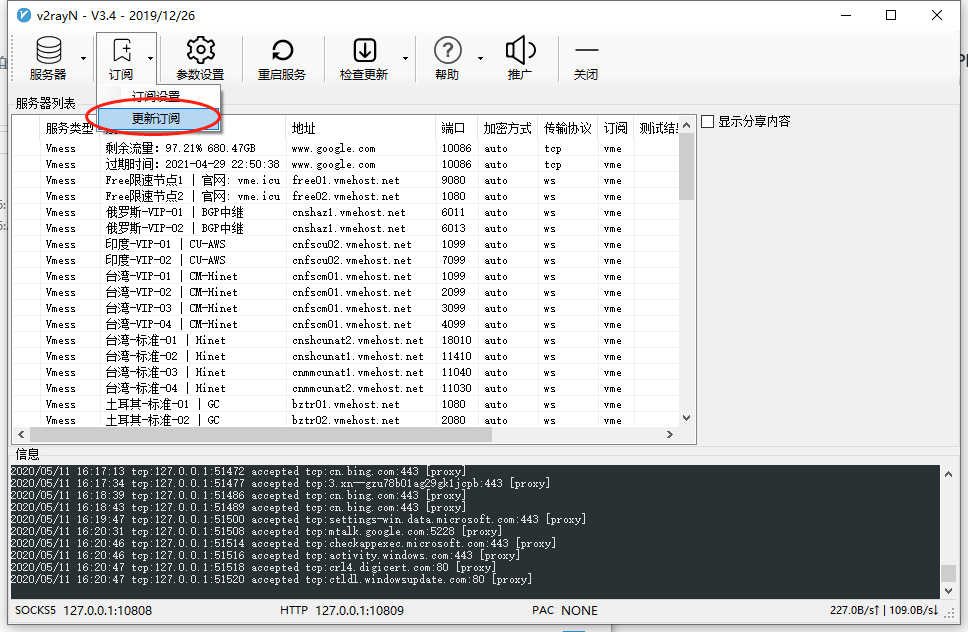
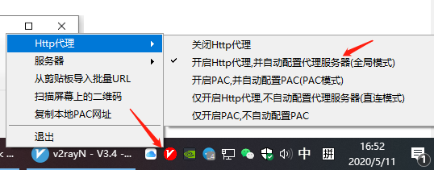
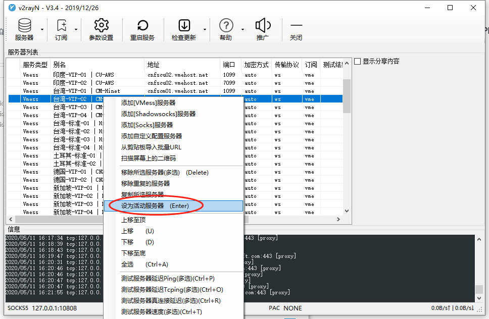

# v2ray

## 1.下载v2ray客户端

[点我下载](https://vme.icu/client-download/v2rayN-Core.zip)

## 2.设置订阅链接

订阅链接可以在**首页**找到

点击复制后粘贴到地址处，点击**确定**。

## 3.更新订阅链接

## 4.右键右下角v2ray图标开启全局模式

## 5.选中节点按回车键开始使用

